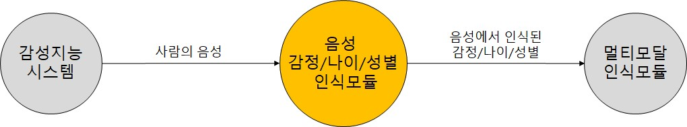
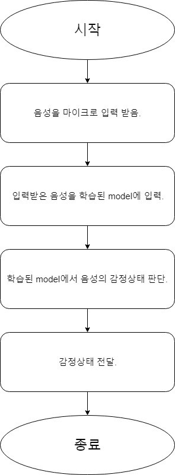
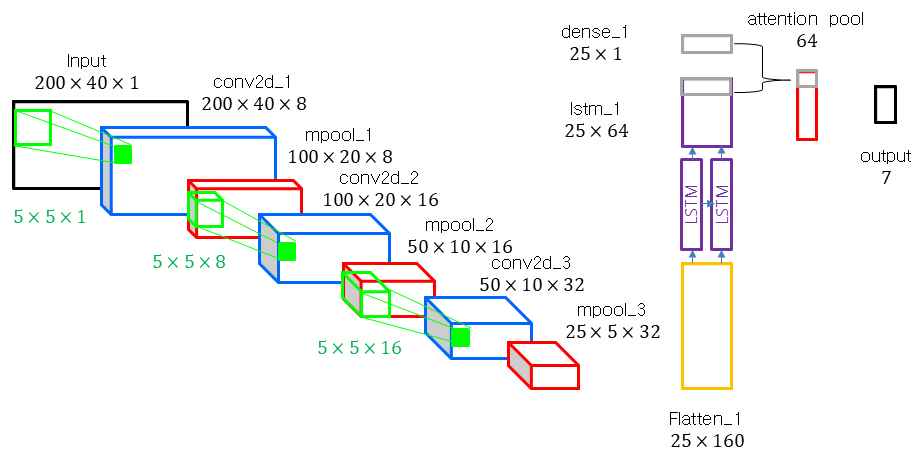
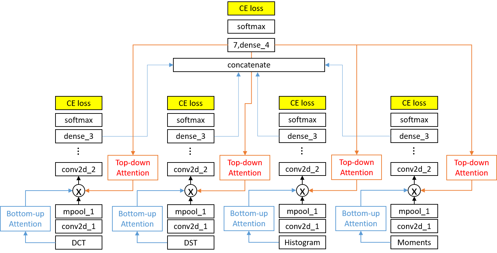
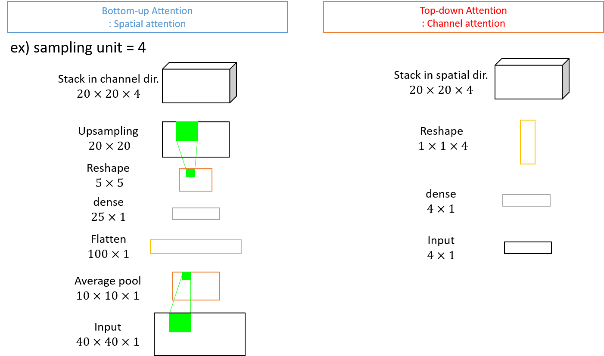

***

#### Note

> (2020/06/19) v1 정식버전이 업데이트 되었습니다.

***

#### System/SW Overview

> 
>
> *Speech emotion recognition 시스템 외부 인터페이스*
>
> 
>
> 
>
> *Speech emotion recognition 기능 흐름도*

***

#### How to Install

```(bash)
pip install -r requirements.txt
```

***

#### Main requirement

> * librosa 0.6.2
> * Keras 2.2.4
> * Keras-Applications 1.0.6
> * Keras-Preprocessing 1.0.5
> * tensorflow-gpu 1.12.0
> * tensorflow 1.12.0
> * numpy 1.16.0
> * scipy 1.2.0
> * pyvad 0.0.8
> * flask 1.0.2

***

#### Network Architecture and features

> * **Model 1:**
>
> 
>
> *Model 1의 Network architecture*
>
> * Input
>   * mel-spectrogram
>   * Mel bins 수 = 40
>   * Frame width = 200
> * Conv + maxpool
>   * Input으로부터 features 추출
> * LSTM
>   * Time frame 방향의 sequential한 feature 추출
> * Attention pool
>   * 인식성능에 도움이 되는 frame에 집중
>   * Frame마다 weight를 계산하여 Attention pool
> * **Model 2:**
>
> 
>
> *Model 2의 Network architecture*
>
> * Input
>   * Log scaled mel-spectrogram으로부터 얻은 features
>   * DCT, DST, Histogram, Normalized moments
>
> * Attention layer
>   * mpool_1의 output과 attention layers의 output을 곱한 값을 conv2d_2의 input으로 사용함
>   * Bottom-up attention과 Top-down attention으로 구성
> * **Attention layer:**
>
> 
>
> *Bottom-up and Top-down attention layer*
>
> * Bottom-up attention
>   * Input
>     * Model 2의 input과 동일
>   * Spatial에 대한 attention 계산
>   * Channel방향으로 동일한 값을 가지도록 함
>
> * Top-down attention
>   * Input
>     * Model 2의 dense_4 output
>   * Channel에 대한 attention 계산
>   * Spatial 방향으로 동일한 값을 가지도록 함.
> * **Model 3**
>
> 
>
> *Model 3의 Network architecture*
>
> * Input
>   * Model 1의 prediction value
>   * Model 2의 prediction values
> * 전체 prediction values를 concatenate한 후 dense layer를 통과하여 최종 prediction 수행
> * **Metrics:**
> * Cross entropy loss

***

#### Quick start

> * Step0. How to Install 참고하여 requirements를 설치한다. 
>* Step1. server 머신에서 아래 명령을 실행한다. 
> 
>```
> python voice_flask_server.py
> ```
> 
>* Step2. Client 머신에서 아래 명령을 실행한다. 
> 
> ```
> python voice_client.py
> ```
>
> * Step3. 다음과 같은 reponse를 얻는다.
> ```
> {"10001": 0.0768, "10002": 0.2007, "10003": 0.1397, "10004": 0.1317, "10005": 0.2603, "10006": 0.0442, "10007": 0.1466, "20000": 28.7858, "20003": 1.0, "20004": 0.0, "20005": 0.0, "30001": 0.0005, "30002": 0.9995}'
> ```

#### (선택) Training Data
> 해당 없음

***

#### (선택) Training Model

> 해당 없음

***

#### (선택) Validation metrics calculation

> 해당 없음

***

#### HTTP-server API description

* **path, parameter, response를 명시한다.**

> *  Path
>
> ```
> voice_flask_server.py
> ```
>
> * JSON parameters are:

> | Parameter | Type   | Description                          |
> | --------- | ------ | ------------------------------------ |
> | path_dir  | string | Path directory of wav file           |
> | wav_name  | string | wav file name                        |
> | 10001     | float  | Emotion prediction value - Happiness |
> | 10002     | float  | Emotion prediction value - Anger     |
> | 10003     | float  | Emotion prediction value - Disgust   |
> | 10004     | float  | Emotion prediction value - Fear      |
> | 10005     | float  | Emotion prediction value - Neutral   |
> | 10006     | float  | Emotion prediction value - Sadness   |
> | 10007     | float  | Emotion prediction value - Surprise  |
> | 20000     | float  | Age prediction value                 |
> | 20003     | float  | 20s age group                        |
> | 20004     | float  | 30s age group                        |
> | 20005     | float  | 40s age group                        |
> | 30001     | float  | Gender prediction value - Male       |
> | 30002     | float  | Gender prediction value - Female     |

> * Request
> ```
> POST 
> data: {
> 'path_dir': ['./'],
> 'wav_name': 'test_dis.wav'
> }
> ```

> * Response OK
> ```
> <Response [200]> success
> {
>  '{"10001": 0.0768, "10002": 0.2007, "10003": 0.1397, "10004": 0.1317, "10005": 0.2603, "10006": 0.0442, "10007": 0.1466, "20000": 28.7858, "20003": 1.0, "20004": 0.0, "20005": 0.0, "30001": 0.0005, "30002": 0.9995}'
> }
> ```

***

#### Repository overview

> * `img/` – README.md의 image
> * `Custom_layer.py` – model을 load하기 위해 필요한 custom layer 정의
> * `Model_Age_crop.h5` – Age recognition model
> * `Model_Emotion_crop.h5` – Emotion recognition model 1
> * `Model_Emotion_Features.h5` – Emotion recognition model 2
> * `Model_Emotion_Merge.h5` – Emotion recognition model 3
> * `test_dis.wav` – test를 위한 wav file
> * `voice_client.py` – input의 path와 wav file name을 요청하는 client 파일
> * `voice_flask_server.py` – 모델을 load하고 음성 감정, 나이, 성별을 인식하기 위한 Flask API server 파일

***

#### (선택) configuration settings

> 해당 없음

***

